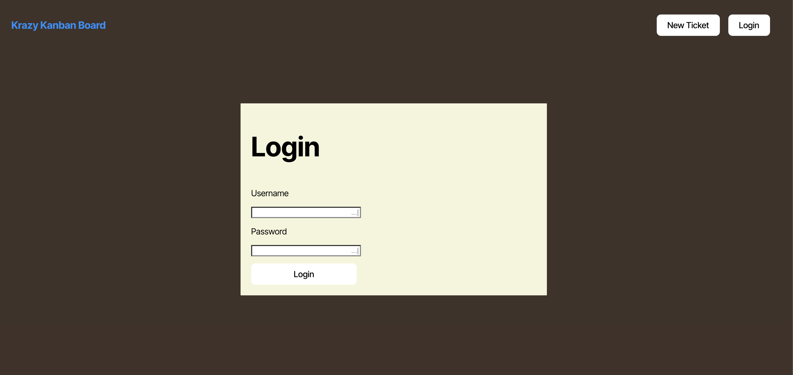

# 🧩 Kanban Board App

The **Kanban Board App** is a web application that allows users to visualize, create, and manage tasks in a column-based system representing their status ("Todo", "In Progress", "Done"). Authenticated users can create, move, and delete tickets, providing a clear and efficient overview of the workflow.

## 📚 Table of Contents

- [Description](#description)
- [Features](#features)
- [Technologies Used](#technologies-used)
- [Installation](#installation)
- [Usage](#usage)
- [Authentication](#authentication)
- [Build the Project](#build-the-project)
- [Deployment](#deployment)
- [Deployed Application](#deployed-application)
- [Screenshots](#screenshots)
- [Contributing](#contributing)
- [License](#license)

## 📖 Description

The **Kanban Board App** simulates a task management board with columns representing different progress states. It's ideal for small teams or individuals looking to organize their tasks visually.

---

## ✅ Features

- 🔐 JWT-based authentication (secure login/logout)
- 📌 Create and delete tickets (tasks)
- 🔄 Change task status by moving or clicking
- 🧹 Clean and responsive UI
- 🧠 Protected API integration to save tickets
- 🕵️‍♀️ Login check before accessing the board

---

## 🛠 Technologies Used

- React.js, TypeScript, CSS, Node.js, Express.js, TypeScript, JWT (JSON Web Token), Vite, Nodemon, dotenv, concurrently

---

## 💾 Installation

### 1. Clone the repository

```bash
git clone https://github.com/ThayRibeiro0/KanbanBoard_App.git
cd KanbanBoard_App
```

### 2. Install dependencies

```bash
npm install
```

### 3. Create a `.env` file in the `/server` directory with the following content

```env
JWT_SECRET=your-secret-key
PORT=3001
```

### 4. Run the database

```bash
psql -U postgres
```

---

## ▶️ Usage

To run the app in development mode:

```bash
npm run start:dev
```

- Frontend: [http://localhost:3000](http://localhost:3000)
- Backend: [http://localhost:3001](http://localhost:3001)

---

## 🔐 Authentication

- Access to the main board is protected. Unauthenticated users are automatically redirected to the login page.
- JWT token is stored locally and verified on each app load.
- Protected endpoint: `/api/tickets`

---

## 🏗️ Build the Project

To generate a production build:

```bash
npm run build
```

---

## 🚀 Deployment

To deploy the app:

1. Push to GitHub.
2. Deploy the backend on **Render.com**.
3. On Render, set:
   - Build command: `npm run render-build`
   - Start command: `npm run start`
   - Environment variables such as `JWT_SECRET`

---

## 🌐 Deployed Application

Check the live application here:  
[🔗 [Kanban Board Live](https://kanbanboard-app.onrender.com/board)](https://kanbanboard-app.onrender.com)

---

## 📸 Screenshots

<div>
  
</div>

---

## 🤝 Contributing

Contributions are welcome! Feel free to open issues or pull requests with improvements, fixes, or ideas.

---

## 📄 License

This project is licensed under the MIT License. See the [LICENSE](LICENSE) file for more information.
